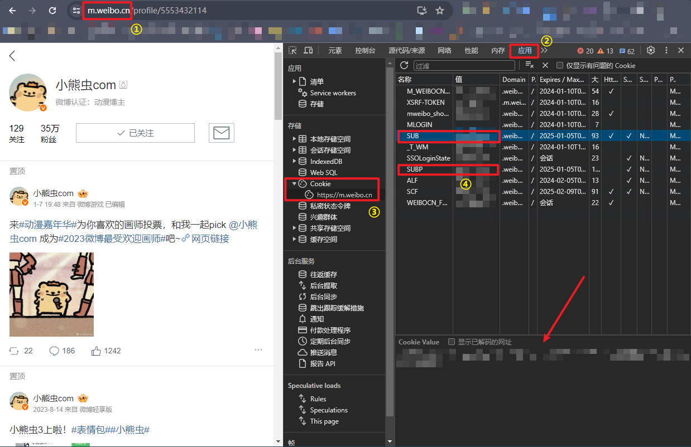

# Weibo Archive

## 说明

本项目是一个微博备份工具，可以将自己的微博账号的所有微博备份到本地，包括长文、图片、视频和评论。

使用前需要将 `cookie_example.json` 重命名为 `cookie.json`，并填入自己的 cookie（注意需要使用 `m.weibo.cn` 的 cookie）

运行结束后 `ext` 和 `resources` 这两个文件夹连同 `posts.json` 就是所有数据了，请妥善保存。

### 如何找到自己的 Cookie

1. 浏览器打开 https://m.weibo.cn/ ，登录自己的微博账号。
2. 按下 F12 打开开发者工具，切换到 Application/应用 选项卡。
3. 侧边栏找到左边 Cookie 选项，点击展开。
4. 找到 "SUB" 和 "SUBP"，将他们的值填入 `cookie.json` 中的 "SUB" 和 "SUBP" 字段。

### 我想重新备份自己的微博，应该怎么做呢？

删除 `cache` 文件夹，然后重新运行 `run.py` 即可。

## TODO

- [x] 保存动态图片。
- [ ] 保存转发的微博内容，包括长文和图片。
